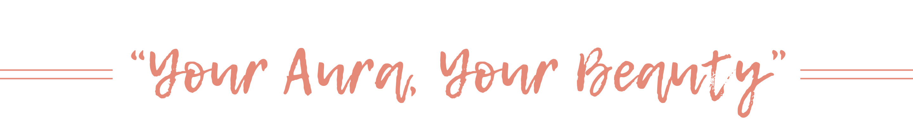

# 💬 AuraBeauty - Node.js and Angular

  

_**IT'S A PROJECT IN A BUSINESS WEBSITE DEVELOPMENT COURSE, NOT A REAL BUSINESS.**_

Aura Beauty is a cosmetic website dedicated to offering high-quality beauty products to its customers. The platform is designed to provide a seamless shopping experience, featuring a wide range of cosmetics, skincare, and beauty accessories tailored to various needs and preferences. This is a website built by **Ngoc To, Kieu Anh, Thanh Huyen, Hoang Kim,** and **Thu Huong.**

## ☑️ Features
- **User Module**: Login, online shopping experience, including product browsing, cart management, and checkout.
- **Admin Module:** Manage dashboard, users, products, blogs, orders, and inventory efficiently.
- **Server:** Backend integration using Node.js for data management and API endpoints.

## ⚙️ Technologies Used
- **Frontend:** Angular
- **Backend:** Node.js (MongoDB)
- **Styling:** CSS (Tailwind)

## 📑 Project Structure 
- **ADMIN:** Admin interface and management functionalities.
- **USER:** Customer-facing interface.
- **SERVER:** Backend server-side code for APIs.

## 📹 Demo Video
- **Client/Customer website:** [Watch the video](https://www.youtube.com/watch?v=1CN0qExa5Go)
- **Admin Website:** [Watch the video](https://youtu.be/dUuEcregVNA)

